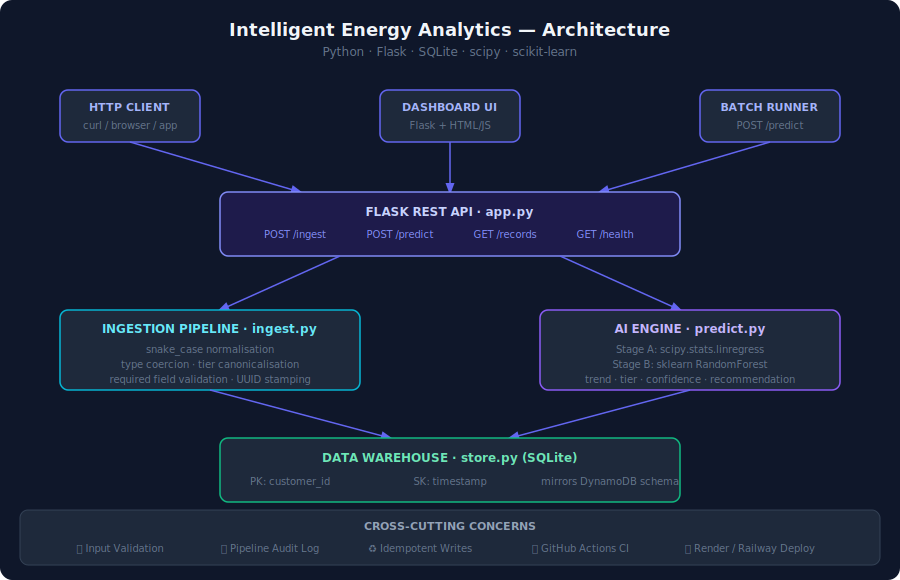

<div align="center">

# ⚡ Intelligent Energy Analytics POC

**A production-grade data ingestion and AI-powered predictive analytics platform**  
built entirely with free, open-source tools — no cloud account required.

[](https://github.com/YOUR_USERNAME/intelligent-energy-analytics-poc/actions)
[](https://python.org)
[](https://flask.palletsprojects.com)
[](https://scikit-learn.org)
[](LICENSE)

[**Live Demo →**](https://your-app.onrender.com) &nbsp;|&nbsp; [API Docs](#api-reference) &nbsp;|&nbsp; [Architecture](#architecture) &nbsp;|&nbsp; [Deploy](#deployment)

</div>

---

## Overview

This project demonstrates a complete, end-to-end data engineering and machine learning pipeline for customer energy telemetry. It simulates the kind of system a utility company or IoT analytics provider would build to:

- **Ingest** semi-structured telemetry from multiple source systems
- **Clean and validate** data through a typed processing layer
- **Store** records in a structured data warehouse
- **Predict** next-month energy usage tiers using a two-stage AI model
- **Surface insights** through an interactive real-time dashboard

Everything runs locally or deploys to a free cloud tier in one command.

---

## Architecture

```
┌─────────────────────────────────────────────────────────────────────┐
│                         ENTRY POINTS                                │
│                                                                     │
│   HTTP Clients          Dashboard UI          Batch Runner          │
│   (curl / apps)         (Flask + JS)          (POST /predict)       │
└──────────────┬──────────────────┬──────────────────┬───────────────┘
               │                  │                  │
               └──────────────────▼──────────────────┘
                                  │
┌─────────────────────────────────▼───────────────────────────────────┐
│                        FLASK REST API  (app.py)                     │
│                                                                     │
│   POST /ingest    POST /predict    GET /records    GET /health      │
└─────────────────────┬───────────────────────┬───────────────────────┘
                      │                       │
         ┌────────────▼──────────┐  ┌─────────▼──────────────┐
         │  INGESTION PIPELINE   │  │     AI ENGINE          │
         │  (ingest.py)          │  │     (predict.py)       │
         │                       │  │                        │
         │ • snake_case normalise │  │ Stage A: linregress    │
         │ • type coercion        │  │   slope · R² · p-val  │
         │ • tier canonicalise   │  │                        │
         │ • required field check │  │ Stage B: RandomForest  │
         │ • UUID + timestamp     │  │   tier · confidence   │
         └────────────┬──────────┘  └─────────┬──────────────┘
                      │                        │
                      └───────────┬────────────┘
                                  │
┌─────────────────────────────────▼───────────────────────────────────┐
│                  DATA WAREHOUSE  (store.py → SQLite)                │
│                                                                     │
│   Table: customer_telemetry                                         │
│   PK: customer_id (STRING)   SK: timestamp (ISO-8601)               │
│   Schema mirrors AWS DynamoDB — swap in boto3 for cloud deploy      │
└─────────────────────────────────────────────────────────────────────┘

Cross-cutting: Input Validation · Audit Logging · Idempotent Writes
               GitHub Actions CI · Render/Railway One-Click Deploy
```



---

## Features

### 📡 Data Ingestion API
- `POST /ingest` accepts flexible, semi-structured JSON payloads
- Normalises field names (CamelCase → snake_case), coerces types, validates required fields
- Canonicalises energy tier labels (`med` → `MEDIUM`, `crit` → `CRITICAL`)
- Idempotent writes — safe to replay events without creating duplicates
- Returns structured responses with record ID and timestamp

### 🤖 AI Prediction Engine
Two-stage model pipeline running entirely in Python:

| Stage | Library | What it does |
|-------|---------|--------------|
| **A — Trend Model** | `scipy.stats.linregress` | Fits OLS linear regression over historical kWh. Returns slope, R², p-value, 95% CI for next month |
| **B — Tier Classifier** | `sklearn.RandomForestClassifier` | Trained on enriched features (kWh, slope, device count, temperature, season). Predicts LOW / MEDIUM / HIGH / CRITICAL |

Falls back to a rule-based threshold classifier when fewer than 4 historical records exist.

### 📊 Interactive Dashboard
- Real-time KPI cards (records, customers, at-risk count)
- Fleet prediction bar chart with tier colour coding
- Per-customer cards: trend analysis, historical summary, model stats, recommendation
- Live data ingestion form with validation feedback
- Filterable records browser

### 🗄️ Data Warehouse
- SQLite backend with schema designed to mirror AWS DynamoDB
- Swap `store.py` for a `boto3` implementation to run on real AWS — zero application code changes required
- Full pipeline audit log

---

## Repository Structure

```
intelligent-energy-analytics-poc/
│
├── src/
│   ├── __init__.py
│   ├── app.py          # Flask application — REST API + dashboard UI
│   ├── ingest.py       # Validation, cleaning, and normalisation layer
│   ├── predict.py      # AI prediction engine (linregress + RandomForest)
│   └── store.py        # SQLite data warehouse (DynamoDB-compatible schema)
│
├── tests/
│   ├── __init__.py
│   └── test_pipeline.py  # Integration tests for ingest + predict pipeline
│
├── docs/
│   └── architecture.svg  # Architecture diagram
│
├── .github/
│   └── workflows/
│       └── ci.yml        # GitHub Actions — test on every push
│
├── requirements.txt
├── Procfile              # For Render / Railway / Heroku
├── render.yaml           # One-click Render deploy config
├── runtime.txt           # Python 3.11
└── README.md
```

---

## Quickstart — Run Locally

### Prerequisites
- Python 3.11+
- pip

### Install and run

```bash
# 1. Clone the repository
git clone https://github.com/YOUR_USERNAME/intelligent-energy-analytics-poc.git
cd intelligent-energy-analytics-poc

# 2. Create a virtual environment
python3 -m venv venv
source venv/bin/activate        # Windows: venv\Scripts\activate

# 3. Install dependencies
pip install -r requirements.txt

# 4. Start the server
python -m src.app
```

Open **http://localhost:7860** — the dashboard loads with 18 seeded sample records ready to analyse.

---

## API Reference

Base URL: `http://localhost:7860` (local) or your deployed URL.

### `GET /health`
Returns server status and record count.

```bash
curl http://localhost:7860/health
```
```json
{
  "status": "ok",
  "records": 18,
  "timestamp": "2024-07-15T10:23:41.123456+00:00"
}
```

---

### `POST /ingest`
Ingest a customer telemetry record.

**Required fields:** `customer_id`, `energy_kwh`, `period_month`

```bash
curl -X POST http://localhost:7860/ingest \
  -H "Content-Type: application/json" \
  -d '{
    "customer_id":       "CUST-042",
    "energy_kwh":        487.3,
    "period_month":      "2024-07",
    "energy_tier":       "medium",
    "region":            "West",
    "device_count":      6,
    "temperature_avg_c": 18.5,
    "notes":             "Summer AC spike"
  }'
```

**201 Created:**
```json
{
  "message":     "Record ingested successfully.",
  "record_id":   "a1b2c3d4-e5f6-7890-abcd-ef1234567890",
  "customer_id": "CUST-042",
  "period_month": "2024-07",
  "timestamp":   "2024-07-15T10:23:41.123456+00:00"
}
```

**400 Bad Request (validation failure):**
```json
{
  "error":  "Validation Failed",
  "detail": "Missing required fields: ['energy_kwh', 'period_month']"
}
```

**Field reference:**

| Field | Type | Required | Notes |
|-------|------|----------|-------|
| `customer_id` | string | ✅ | Bare integers prefixed with `CUST-` |
| `energy_kwh` | number | ✅ | Must be ≥ 0 |
| `period_month` | string | ✅ | Format: `YYYY-MM` |
| `energy_tier` | string | ❌ | `low` / `medium` / `high` / `critical` (any casing) |
| `region` | string | ❌ | Stored as uppercase |
| `device_count` | integer | ❌ | Number of connected meters/devices |
| `temperature_avg_c` | number | ❌ | Average ambient temperature in °C |
| `notes` | string | ❌ | Max 500 characters |

---

### `POST /predict`
Run the AI batch engine over all stored records. Returns the full prediction report.

```bash
curl -X POST http://localhost:7860/predict \
  -H "Content-Type: application/json" \
  -d '{}'
```

**200 OK:**
```json
{
  "report_metadata": {
    "generated_at": "2024-07-15T10:25:00+00:00",
    "total_customers": 3,
    "total_records": 18,
    "model": "scipy.linregress + sklearn.RandomForestClassifier"
  },
  "customer_predictions": [
    {
      "customer_id": "CUST-002",
      "record_count": 6,
      "date_range": { "first": "2024-01", "last": "2024-06" },
      "trend_analysis": {
        "slope_kwh_per_month": 48.16,
        "direction": "INCREASING",
        "r_squared": 0.9978
      },
      "prediction": {
        "predicted_kwh": 961.19,
        "kwh_lower_bound": 884.29,
        "kwh_upper_bound": 1038.09,
        "predicted_tier": "CRITICAL",
        "confidence": 0.98,
        "method": "RANDOM_FOREST"
      },
      "recommendation": "Urgent: CUST-002 predicted CRITICAL tier..."
    }
  ],
  "fleet_summary": {
    "tier_distribution": { "CRITICAL": 1, "MEDIUM": 2 },
    "customers_at_risk": ["CUST-002"],
    "customers_declining": ["CUST-003"]
  }
}
```

---

### `GET /records`
Return all stored records, optionally filtered by customer.

```bash
# All records
curl http://localhost:7860/records

# Filter by customer
curl "http://localhost:7860/records?customer_id=CUST-001"
```

---

### `GET /customers`
Return list of all customer IDs.

```bash
curl http://localhost:7860/customers
```

---

## Deployment

### Option 1 — Render.com (recommended, free tier)

[](https://render.com/deploy)

1. Fork this repository
2. Go to [render.com](https://render.com) → New → Web Service
3. Connect your forked repo — Render auto-detects `render.yaml`
4. Click **Deploy** — your app will be live at `https://your-app.onrender.com`

> **Note:** Render's free tier spins down after 15 minutes of inactivity. The first request after idle takes ~30 seconds to cold start.

---

### Option 2 — Railway.app

```bash
# Install Railway CLI
npm install -g @railway/cli

# Login and deploy
railway login
railway init
railway up
```

---

### Option 3 — Local with public URL (ngrok)

```bash
# Terminal 1 — run the app
python -m src.app

# Terminal 2 — expose publicly
ngrok http 7860
```

---

## Running Tests

```bash
# Install test dependencies
pip install pytest

# Run the full test suite
pytest tests/ -v
```

```
tests/test_pipeline.py::TestIngest::test_valid_payload              PASSED
tests/test_pipeline.py::TestIngest::test_bare_integer_customer_id  PASSED
tests/test_pipeline.py::TestIngest::test_camel_case_keys_normalised PASSED
tests/test_pipeline.py::TestIngest::test_missing_required_field     PASSED
tests/test_pipeline.py::TestIngest::test_negative_kwh_raises        PASSED
tests/test_pipeline.py::TestIngest::test_bad_period_month_raises    PASSED
tests/test_pipeline.py::TestIngest::test_tier_normalisation         PASSED
tests/test_pipeline.py::TestPredict::test_kwh_to_tier               PASSED
tests/test_pipeline.py::TestPredict::test_linregress_increasing     PASSED
tests/test_pipeline.py::TestPredict::test_linregress_decreasing     PASSED
tests/test_pipeline.py::TestPredict::test_run_batch_full_pipeline   PASSED
tests/test_pipeline.py::TestPredict::test_prediction_has_required_keys PASSED
```

---

## Design Decisions & Trade-offs

| Decision | Rationale | Trade-off |
|----------|-----------|-----------|
| SQLite over PostgreSQL | Zero infrastructure, single file, instant setup | Not suitable for concurrent writes at scale |
| scipy linregress | Interpretable, no training data needed, fast | Assumes linear growth; won't capture non-linear seasonality |
| RandomForest over deep learning | Trains in milliseconds on small datasets, no GPU | Less accurate than neural approaches on large datasets |
| Rule-based fallback (< 4 records) | Works from day one with minimal data | Less nuanced than ML; ignores trend signals |
| Flask over FastAPI | Simpler, well-documented, fewer dependencies | No async support; would use FastAPI for high-throughput production |
| DynamoDB-compatible schema | Drop-in swap to real AWS with `boto3` — no app changes | Slightly denormalised structure |

---

## Extending the Project

### Swap SQLite for real AWS DynamoDB
Replace `store.py` with a `boto3` implementation — the rest of the application is unchanged:
```python
# store.py — production version
import boto3
table = boto3.resource('dynamodb').Table('CustomerTelemetryData')
```

### Add authentication
```python
from functools import wraps
def require_api_key(f):
    @wraps(f)
    def decorated(*args, **kwargs):
        if request.headers.get('X-API-Key') != os.environ['API_KEY']:
            return jsonify({'error': 'Unauthorized'}), 401
        return f(*args, **kwargs)
    return decorated
```

### Add time-series forecasting
Replace `linregress` with Facebook Prophet for seasonality-aware forecasting:
```python
from prophet import Prophet
model = Prophet(yearly_seasonality=True, weekly_seasonality=False)
model.fit(df)
future = model.make_future_dataframe(periods=1, freq='MS')
forecast = model.predict(future)
```

---

## Tech Stack

| Layer | Technology | Version |
|-------|-----------|---------|
| Web framework | Flask | 3.0 |
| Trend model | scipy.stats | 1.12 |
| Tier classifier | scikit-learn | 1.4 |
| Numerical | NumPy | 1.26 |
| Data store | SQLite (stdlib) | — |
| Production server | Gunicorn | 21.2 |
| CI/CD | GitHub Actions | — |
| Deploy | Render / Railway | — |
| Language | Python | 3.11 |

---

## License

MIT — free to use, modify, and distribute.

---

<div align="center">
Built as a production-grade proof of concept demonstrating data engineering,
REST API design, and ML pipeline best practices.
</div>
